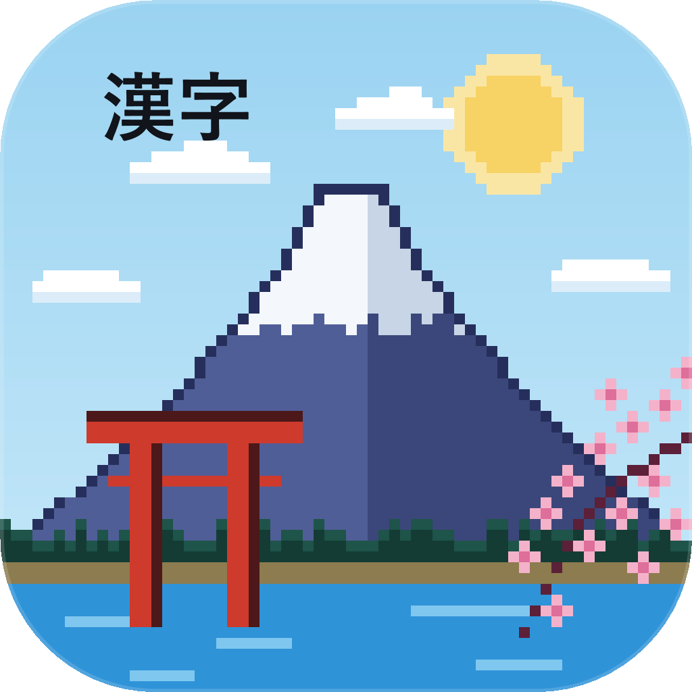
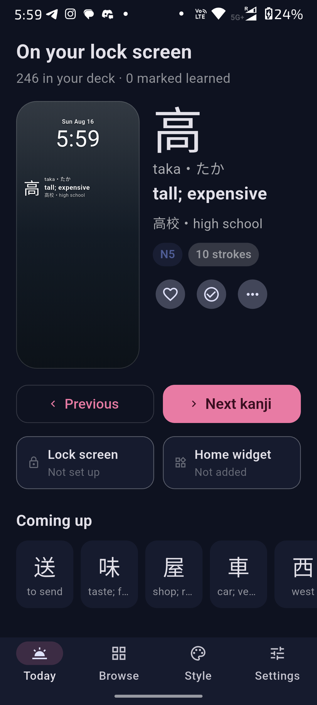
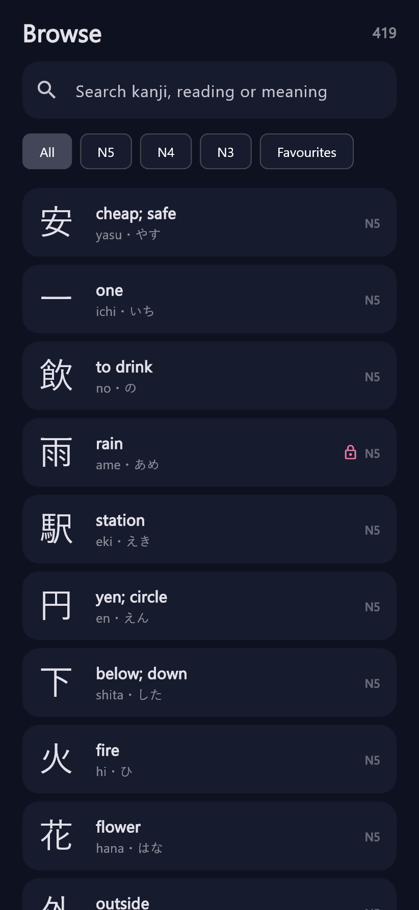
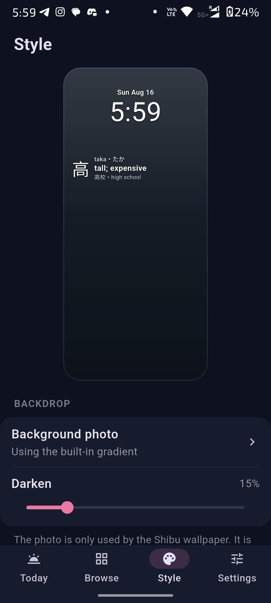
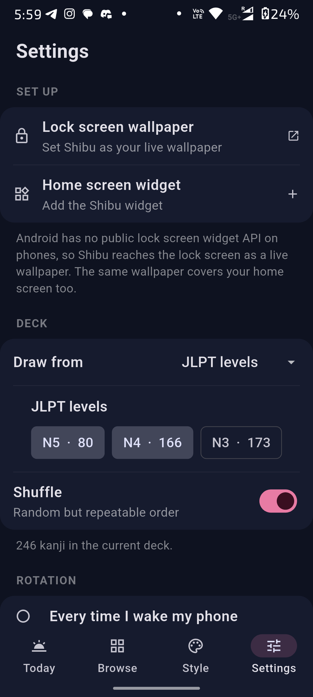
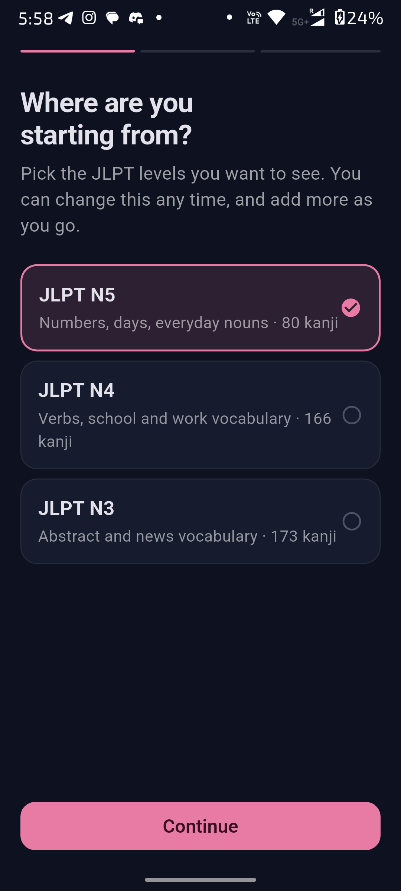
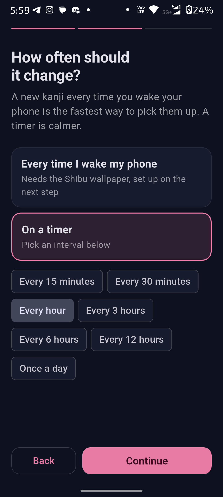
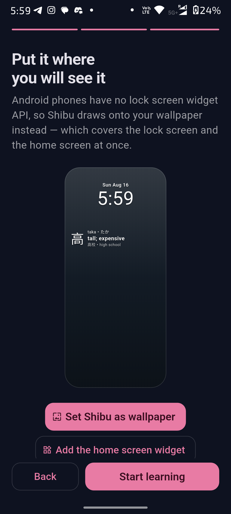
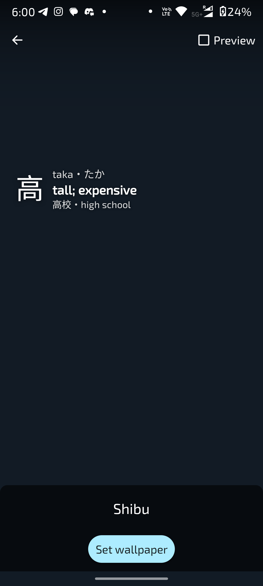

<div align="center">



# Shibu

**Learn Japanese kanji from your lock screen.**

A new kanji every time you wake your phone — the character, how it is read, what
it means, and a word that uses it. No app to open, no streak to keep.

[](https://github.com/Rohan3280/shibu/actions/workflows/ci.yml)
[](https://github.com/Rohan3280/shibu/releases/latest)
[](LICENSE)
[](https://developer.android.com)

[**Download the latest APK**](https://github.com/Rohan3280/shibu/releases/latest)

</div>

---

## What it looks like

<div align="center">




</div>

The card itself is deliberately plain, so it sits under your clock without
fighting it:

```
駅   eki・えき
     station
     駅前・in front of station
```

Setting up takes three steps, and both surfaces are optional:

<div align="center">




</div>

The last image is the live wallpaper itself, drawn by the native renderer —
that is what you see behind your lock screen.

## Features

- **419 kanji** across JLPT N5, N4 and N3, each with its reading, meaning, and
  an example compound — bundled in the APK, so nothing is downloaded.
- **Lock screen and home screen**, from one setting.
- **Rotation you choose** — a new kanji on every unlock, or on a timer from 15
  minutes to once a day.
- **Your own photo, GIF or animated WebP** as the backdrop, plus seven built-in
  gradients, with adjustable dimming. Animation is capped and pauses whenever
  the wallpaper is not on screen, and can be switched off entirely.
- **Full control of the card**: text colour, size, alignment, position, drop
  shadow, and which of the three lines to show.
- **Decks and progress** — pick your levels, favourite the ones you want to see
  more of, mark the ones you know.
- **Completely offline.** Shibu declares no internet permission at all, so it
  cannot phone home even by accident.

## Install

Grab the APK from the [latest release](https://github.com/Rohan3280/shibu/releases/latest)
and install it. Android will warn you about installing outside the Play Store —
that is expected for a sideloaded build.

Two APK flavours are published:

| File | Use it when |
| --- | --- |
| `shibu-<version>-arm64.apk` | Any phone from the last several years. Smallest download. |
| `shibu-<version>-universal.apk` | You are not sure, or you are installing on an emulator. Works everywhere. |

Requires **Android 7.0 (API 24)** or newer. 1.0.0 was verified on a Motorola
Edge 50 Fusion running Android 16.

## How it reaches the lock screen

This is the part worth understanding before you file a bug.

**Android has no public lock screen widget API on phones.** It was removed in
Android 5.0, and the version that returned in Android 14 is tablet-only. The
iOS apps that inspired Shibu use `WidgetKit`, which simply has no Android
counterpart.

So Shibu draws onto your **wallpaper** instead. The system paints the same
wallpaper surface behind the lock screen and the home screen, which means one
live wallpaper covers both — on every Android version, with no root and no
accessibility permissions.

```
                    ┌──────────────────────────────┐
                    │   assets/data/kanji.json     │
                    │   419 entries, in the APK    │
                    └───────────────┬──────────────┘
                                    │
                    ┌───────────────▼──────────────┐
                    │        RotationEngine        │
                    │  decides which card is due   │
                    └───┬──────────────────────┬───┘
                        │                      │
          ┌─────────────▼────────┐  ┌──────────▼───────────┐
          │ ShibuWallpaperService│  │ ShibuWidgetProvider  │
          │ lock + home screen   │  │ home screen widget   │
          └─────────────┬────────┘  └──────────┬───────────┘
                        │                      │
                        └──────────┬───────────┘
                                   │
                    ┌──────────────▼───────────────┐
                    │        CardRenderer          │
                    │  one Canvas layout, so both  │
                    │  surfaces look identical     │
                    └──────────────────────────────┘
```

The home screen widget is a normal `AppWidgetProvider` and works on its own if
you would rather not change your wallpaper.

### Why "every unlock" needs the wallpaper

Android does not deliver `ACTION_USER_PRESENT` to manifest-declared receivers,
and Shibu will not run a foreground service just to watch your screen. The
wallpaper engine, however, is told when it becomes visible — which is exactly
the moment the lock screen appears. That is the signal Shibu uses.

If you use the widget without the wallpaper, choose a timed interval instead.
The app says so on the settings screen rather than silently doing nothing.

### Why a timed rotation can be late

WorkManager will not run a periodic job more often than every 15 minutes, and
Doze can delay it further. Shibu runs a 15-minute heartbeat that checks whether
your chosen interval has elapsed, so a card can appear up to 15 minutes after
it was due. Shorter intervals are not offered, because they would be a promise
the platform will not keep.

## Building from source

```bash
git clone https://github.com/Rohan3280/shibu.git
cd shibu
flutter pub get
flutter build apk --release
```

You need Flutter 3.44+ and JDK 17. The release build falls back to the debug
signing key unless `android/key.properties` exists, so a fresh clone builds
without any secrets.

To sign your own release build, create `android/key.properties`:

```properties
storeFile=upload-keystore.jks
storePassword=…
keyAlias=upload
keyPassword=…
```

### Project layout

| Path | What lives there |
| --- | --- |
| `lib/models/` | `Kanji` and the settings value type |
| `lib/services/` | Deck loading, the method channel, the app-wide controller |
| `lib/screens/` | Today, Browse, Style, Settings, onboarding |
| `lib/widgets/` | The Flutter port of the card, and the lock screen preview |
| `android/…/render/` | `CardRenderer` — the Canvas layout both surfaces draw |
| `android/…/wallpaper/` | The live wallpaper engine |
| `android/…/widget/` | The home screen `AppWidgetProvider` |
| `android/…/rotation/` | When the card changes, and the background heartbeat |
| `assets/data/kanji.json` | The deck, read by both Dart and Kotlin |
| `tool/icon/` | Regenerates the app icon |

### The card is implemented twice — on purpose

`CardRenderer.kt` draws the real card onto a `Canvas`; `KanjiCard` draws the
in-app preview in Flutter. They are separate implementations of one design, and
their size constants mirror each other. If you change one, change the other.

The same applies to the deck shuffle: `DeckOrder` exists in both Dart and
Kotlin because `dart:math`'s `Random` and `java.util.Random` are different
algorithms, and a mismatch would make the app advertise a different kanji from
the one actually on your lock screen. `test/deck_order_test.dart` pins both to
goldens produced on the JVM by `tool/verify_deck_order/`.

### Tests

```bash
flutter test                                          # unit and widget tests
flutter test --update-goldens test/screenshots.dart   # re-render docs/screenshots/rendered/
```

The images at the top of this README are captured from a real device. The
renderer above is a fallback that draws the same screens straight from the
widget tree, for when no phone is to hand.

## Privacy

Shibu has **no internet permission**. It stores your settings in
`SharedPreferences` and, if you pick one, a copy of your chosen backdrop in its
own private storage. Nothing leaves the device.

Full policy: <https://rohan3280.github.io/shibu/privacy.html>
(source: [PRIVACY.md](PRIVACY.md))

## Contributing

Bug reports and kanji-data corrections are very welcome — see
[CONTRIBUTING.md](CONTRIBUTING.md). The dataset is hand-checked but 419 entries
is enough for mistakes to hide in, and `test/kanji_repository_test.dart` will
catch structural ones.

## Acknowledgements

The lock screen card layout is modelled on **Moji Widgets** for iOS, which has
no Android version. Shibu is an independent implementation, not affiliated with
it.

## License

[MIT](LICENSE).
